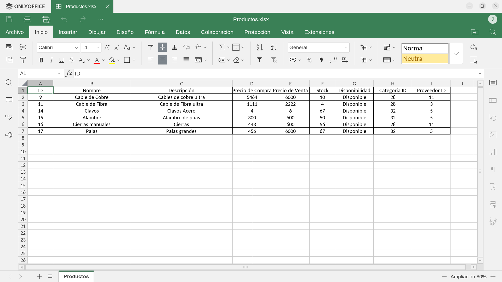
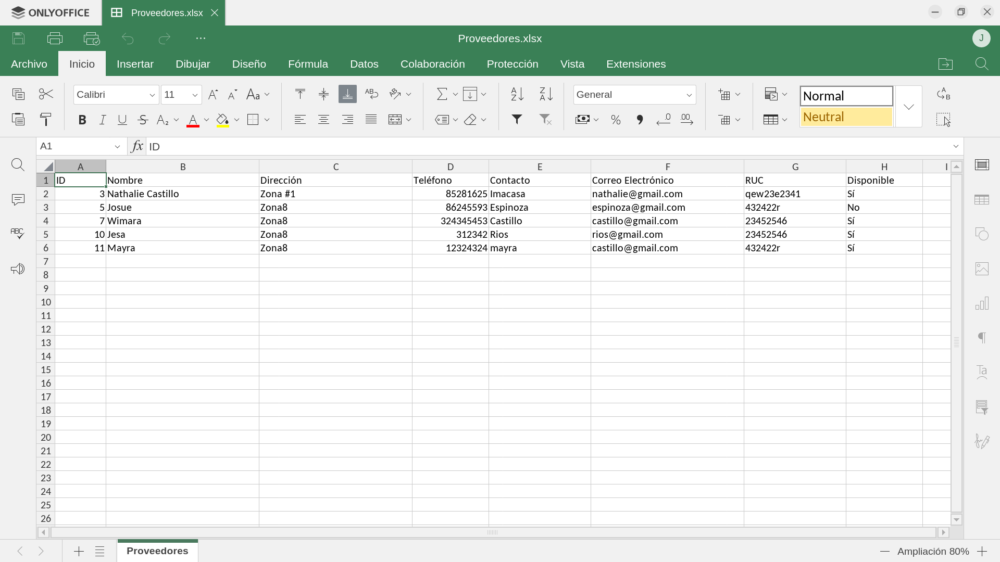
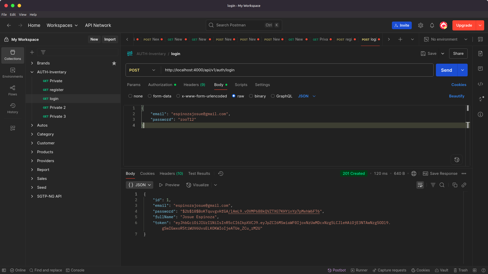
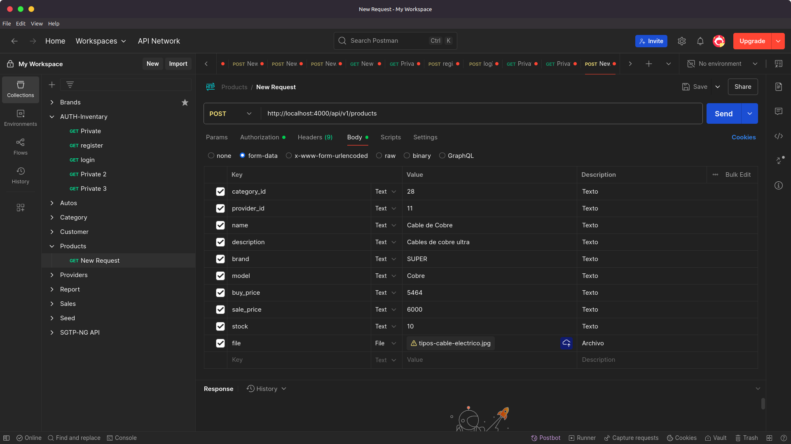
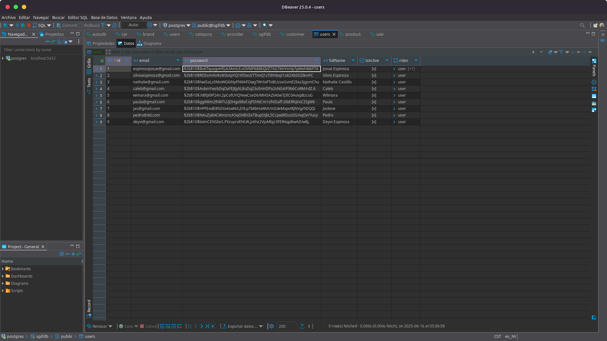
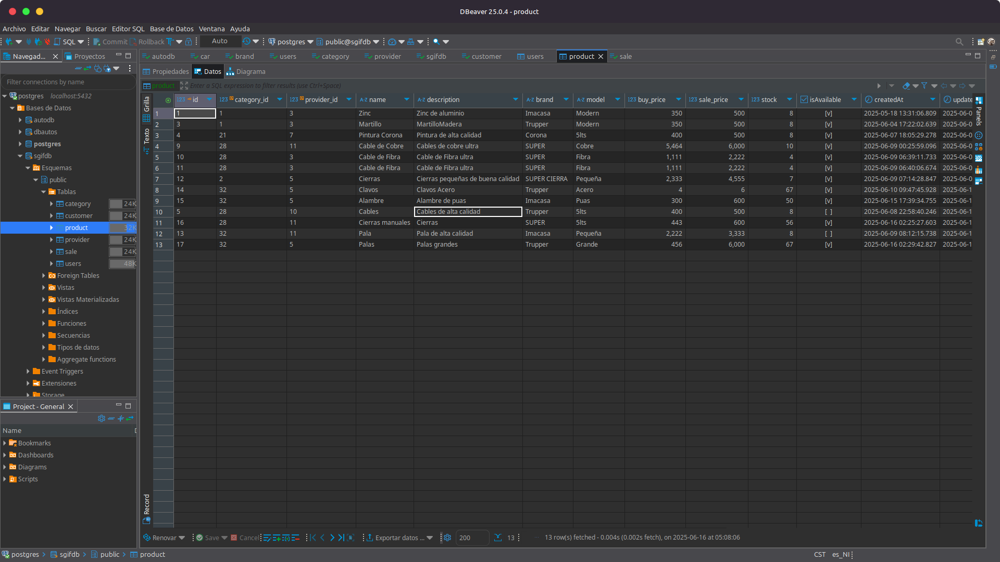
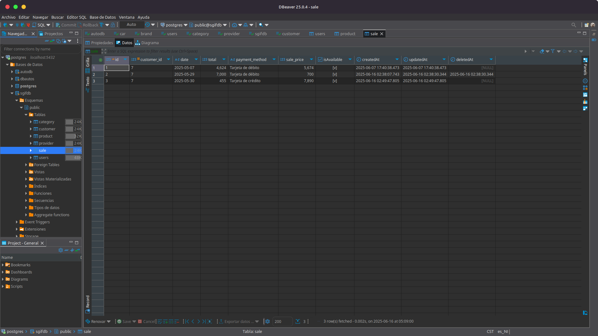

<p align="center">
  <a href="http://nestjs.com/" target="blank"></a>
</p>

[circleci-image]: https://img.shields.io/circleci/build/github/nestjs/nest/master?token=abc123def456
[circleci-url]: https://circleci.com/gh/nestjs/nest

  <p align="center">A progressive <a href="http://nodejs.org" target="_blank">Node.js</a> framework for building efficient and scalable server-side applications.</p>
    <p align="center">
<a href="https://www.npmjs.com/~nestjscore" target="_blank"></a>
<a href="https://www.npmjs.com/~nestjscore" target="_blank"></a>
<a href="https://www.npmjs.com/~nestjscore" target="_blank"></a>
<a href="https://circleci.com/gh/nestjs/nest" target="_blank"></a>
<a href="https://discord.gg/G7Qnnhy" target="_blank"></a>
<a href="https://opencollective.com/nest#backer" target="_blank"></a>
<a href="https://opencollective.com/nest#sponsor" target="_blank"></a>
  <a href="https://paypal.me/kamilmysliwiec" target="_blank"></a>
    <a href="https://opencollective.com/nest#sponsor"  target="_blank"></a>
  <a href="https://twitter.com/nestframework" target="_blank"></a>
</p>
  <!--[](https://opencollective.com/nest#backer)
  [](https://opencollective.com/nest#sponsor)-->

[Nest](https://github.com/nestjs/nest) framework TypeScript starter repository.

# Inventario Ferretería Backend


## Descripción

Este proyecto es un sistema de inventario desarrollado con **NestJS** para el backend, utilizando **PostgreSQL** como base de datos. Su objetivo es gestionar productos, proveedores, categorías y ventas de manera eficiente, resolviendo problemas comunes de administración en negocios pequeños y medianos.

### Tecnologías usadas:
- **NestJS**: Framework progresivo para aplicaciones Node.js.
- **PostgreSQL**: Base de datos relacional.
- **ExcelJS**: Generación de reportes en formato Excel.
- **Swagger**: Documentación interactiva de APIs.
- **Multer**: Middleware para la gestión de archivos.
- **Passport**: Autenticación basada en estrategias.
- **TypeORM**: ORM para la gestión de la base de datos.
- **bcrypt**: Encriptación de contraseñas.
- **RxJS**: Programación reactiva.
- **npm**: Gestor de paquetes utilizado en lugar de **yarn**.

---

## Requisitos Previos

Antes de comenzar, asegúrate de tener instalados los siguientes requisitos:

- **Node.js**: 22.14.0.
- **npm**: 11.3.0.
- **PostgreSQL**: 16.9.

---

## Instalación y Configuración

Sigue estos pasos para clonar e instalar el proyecto:

1. Clonar el repositorio:
   ```bash
   git clone https://github.com/tu_usuario/inventario_backend.git
   ```

2. Instalar las dependencias:
   ```bash
   npm install
   ```

3. Configurar las variables de entorno:
   - Clona el archivo `.env.template` y renómbralo a `.env`.
   - Modifica las variables según tu configuración:
     ```properties
     DB_NAME=sgifdb
     DB_PASSWORD=*****
     DB_HOST=localhost
     DB_PORT=5432
     DB_USERNAME=postgres
     JWT_SECRET=******
     BASE_URL=http://localhost:4000
     ```

4. Crear la base de datos:
     ```
   - Crear la base de datos en PostgreSQL manualmente:
     ```sql
     CREATE DATABASE sgifdb;
     ```

---

## Ejecución del Proyecto

Para ejecutar el proyecto, utiliza uno de los siguientes comandos:

### Desarrollo:
```bash
npm run start:dev
```


---

## Uso del Sistema

### Endpoints clave:
A continuación, se listan algunos de los endpoints más importantes del sistema:

#### Autenticación:
- **POST /auth/login**: Iniciar sesión.
- **POST /auth/register**: Registrar un nuevo usuario.

#### Productos:
- **GET /products**: Obtener todos los productos.
- **POST /products**: Crear un nuevo producto.
- **GET /products/report/excel**: Descargar reporte de productos en Excel.

#### Proveedores:
- **GET /providers**: Obtener todos los proveedores.
- **POST /providers**: Crear un nuevo proveedor.
- **GET /providers/report/excel**: Descargar reporte de proveedores en Excel.

#### Categorías:
- **GET /categories**: Obtener todas las categorías.
- **POST /categories**: Crear una nueva categoría.

#### Clientes:
- **GET /customers**: Obtener todos los clientes.
- **POST /customers**: Crear un nuevo proveedor.
- **GET /customers/report/excel**: Descargar reporte de clientes en Excel.

#### Ventas:
- **GET /sales**: Obtener todas las ventas.
- **POST /sales**: Crear una nueva venta.

### Capturas de pantalla de algunos reportes:
#### Reporte de Productos:

#### Reporte de Proveedores:


---

### Capturas de pantalla de algunas peticiones en Postman:
#### Registro de un usuario:

#### Inicio de sesión:

#### Registro de un producto:



### Capturas de pantalla de algunas tablas en la base de datos...:
#### Tabla de usuarios:

#### Tabla de productos:

#### Tabla de ventas:


## Recursos

- **NestJS Documentation**: [https://docs.nestjs.com](https://docs.nestjs.com)
- **PostgreSQL Documentation**: [https://www.postgresql.org/docs/](https://www.postgresql.org/docs/)
- **ExcelJS Documentation**: [https://github.com/exceljs/exceljs](https://github.com/exceljs/exceljs)
- **Swagger Documentation**: [https://swagger.io/docs/](https://swagger.io/docs/)
- **TypeORM Documentation**: [https://typeorm.io/](https://typeorm.io/)

---
## License

Nest is [MIT licensed](https://github.com/nestjs/nest/blob/master/LICENSE).
